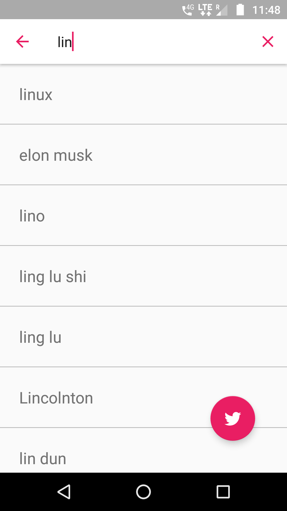
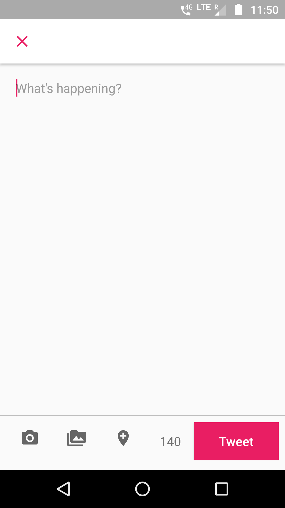

# Loklak Wok for Android

[](https://travis-ci.org/fossasia/loklak_wok_android)
[](https://codecov.io/github/fossasia/loklak_wok_android)

Loklak Wok Android is a message harvesting peer for the loklak_server.

Users can also search tweets from the app, the displayed tweets are the latest tweets, tweets containing images and videos. Along with that, the app provides a tweet posting feature. Users can directly post the tweet from the app. Not only text, but images can also be tweeted from the app.

### Screenshots of the app

<table>
  <tr>
    <td></td>
    <td></td>
    <td></td>
  <tr>
    <td></td>
    <td></td>
    <td></td>
  </tr>
</table>

## Communication
Please join our mailing list to discuss questions regarding the project: https://groups.google.com/forum/#!forum/opntec-dev

Our chat channel is on gitter here: https://gitter.im/loklak/loklak.

## Development Environment Setup
Clone the repository
```
$ git clone https://github.com/fossasia/loklak_wok_android.git 
```
Before you begin, you should already have the Android Studio SDK downloaded and set up correctly. You can find a guide on how to do this here: [Setting up Android Studio](http://developer.android.com/sdk/installing/index.html?pkg=studio)

### Setting up the Android Project

1. Download the [_loklak_wok_android_ project source](https://github.com/fossasia/loklak_wok_android). You can do this either by forking and cloning the repository (recommended if you plan on pushing changes) or by downloading it as a ZIP file and extracting it.

2. Open Android Studio, you will see a **Welcome to Android** window. Under Quick Start, select _Import Project (Eclipse ADT, Gradle, etc.)_

3. Navigate to the directory where you saved the loklak_wok_android project, select this folder.

4. Once this process is complete and Android Studio opens, check the Console for any build errors.
   _Note:_ If you receive a Gradle sync error titled, "failed to find ...", you should click on the link below the error message (if available) that says _Install missing platform(s) and sync project_ and allow Android studio to fetch you what is missing.

5. Once all build errors have been resolved, you should be all set to build the app and test it.

6. To Build the app, go to _Build>Make Project_ (or alternatively press the Make Project icon in the toolbar).

7. If the app was built successfully, you can test it by running it on either a real device or an emulated one by going to _Run>Run 'app'_ or pressing the Run icon in the toolbar.

## Libraries Used
* Retrofit [docs](http://square.github.io/retrofit/2.x/retrofit/)
* Gson [docs](http://www.javadoc.io/doc/com.google.code.gson/gson/2.8.1)
* ButterKnife [docs](http://jakewharton.github.io/butterknife/javadoc/)
* RxJava [docs](http://reactivex.io/RxJava/javadoc/)
* RxAndroid [docs](https://www.javadoc.io/doc/io.reactivex/rxandroid/1.2.1)
* LiquidCore [docs](https://liquidplayer.github.io/LiquidCoreAndroid/0.2.2/)
* Glide [docs](http://bumptech.github.io/glide/javadocs/images/360/index.html)

The project uses **lambda expressions** and **RxJava** heavily. So, if you are new to these, the 
following resources would be helpful to get you started:
* Lambda Expressions
    * [Jenkov Tutorials](http://tutorials.jenkov.com/java/lambda-expressions.html) for a quick start.
    * [Java Brains](https://www.youtube.com/playlist?list=PLqq-6Pq4lTTa9YGfyhyW2CqdtW9RtY-I3) youtube
    series for a detail understanding.
* RxJava
    * [Grokking RxJava](http://blog.danlew.net/2014/09/15/grokking-rxjava-part-1/) series by Dan Lew.
    * Code Tutplus RxJava series ([Introduction](https://code.tutsplus.com/tutorials/getting-started-with-rxjava-20-for-android--cms-28345), 
    [Operators](https://code.tutsplus.com/tutorials/reactive-programming-operators-in-rxjava-20--cms-28396) 
    and [Use in Android](https://code.tutsplus.com/tutorials/rxjava-for-android-apps-introducing-rxbinding-and-rxlifecycle--cms-28565)) by Jessica Thornsby.

## Contributions, Bug Reports and Feature Requests
This is an Open Source project and we would be happy to see contributors who report bugs and file 
feature requests submitting pull requests as well. Please report issues here 
https://github.com/fossasia/loklak_wok_android/issues.

## Branch Policy
* **master** All development goes on in this branch. If you're making a contribution, you are 
supposed to make a pull request to master. PRs to master must pass a build check on Travis.
* **apk** This branch contains apks, that are automatically generated on merging the latest pull request.

## Code Style Guidelines
For contributions please read the [CODESTYLE](https://source.android.com/source/code-style) carefully.
An additional rule: Maximum 100 characters per line.

Try to remove as many warnings (yellow markings on the right side of Android Studio) as possible, 
It's not completely possible to remove all the warnings, but over a period of time, we should try to
 make it as complete as possible.

## LICENSE
This is licensed under LGPL 2.1.
